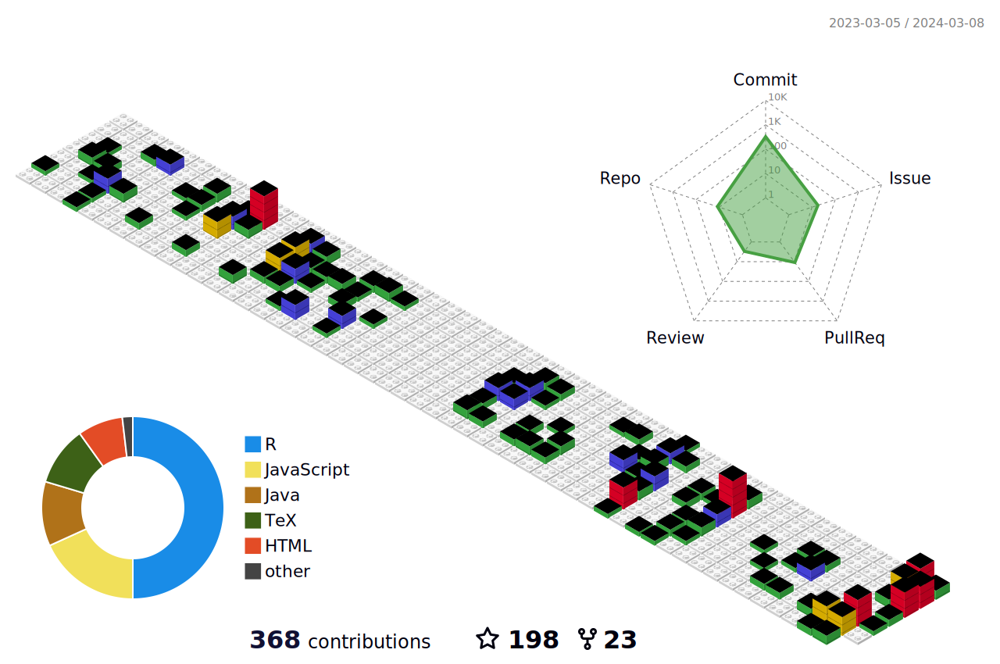

# Welcome!

<canvas id="cnv"></canvas>
```{js}
cnv.width = 200;
cnv.height = 10;
ctx.fillStyle = "#112";
ctx.fillRect(0, 0, 200, 10)
```

<a href="https://twitter.com/brandmaier">

</a>
<a href="https://www.linkedin.com/in/andreas-brandmaier-a93a782a/">

</a>

<p>&nbsp;</p>

I'm a professor for research methods at the Department of Psychology at the MSB Medical School Berlin and a senior research scientist at the Center for Lifespan Psychology at the Max Planck Institute for Human Development. I believe in free software and open science.

If you are here for our structural equation modeling semtree package, you can find it [here](https://github.com/brandmaier/semtree).

📫 How to reach me: brandmaier@mpib-berlin.mpg.de

💬 Ask me about statistics, data wrangling, machine learning, multivariate models, latent variable models, longitudinal research designs, open science or anything else.

🔭 I’m currently working on Onyx, SEM trees, and optimal longitudinal study design

📝 [Portfolio](https://www.brandmaier.de/)

## Languages




## Let's colaborate 

🚀 I'm always open to collaborating on exciting projects and ideas. Feel free to reach out!
